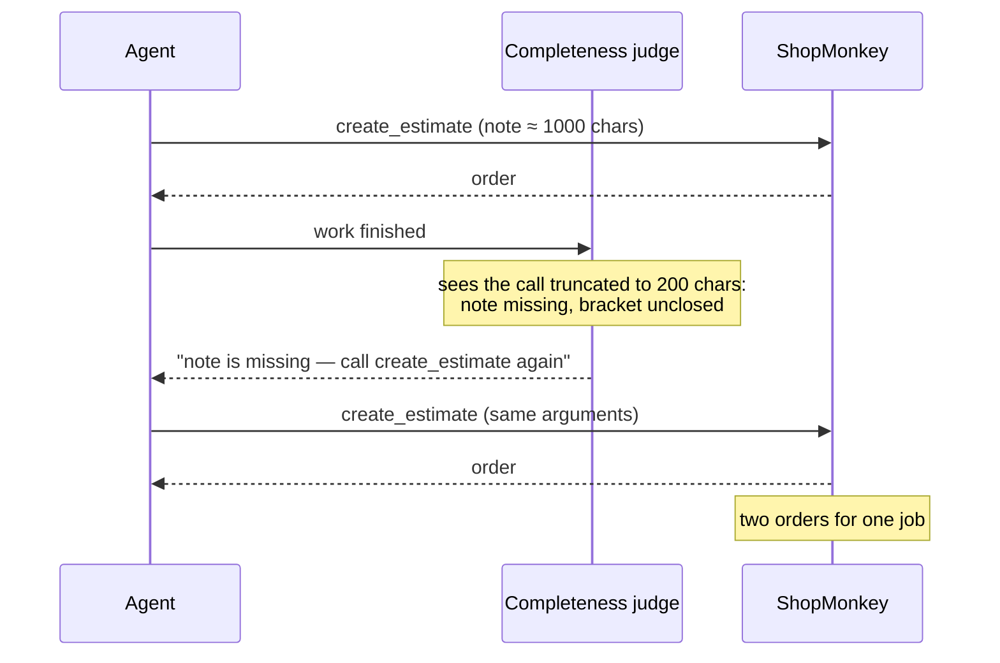
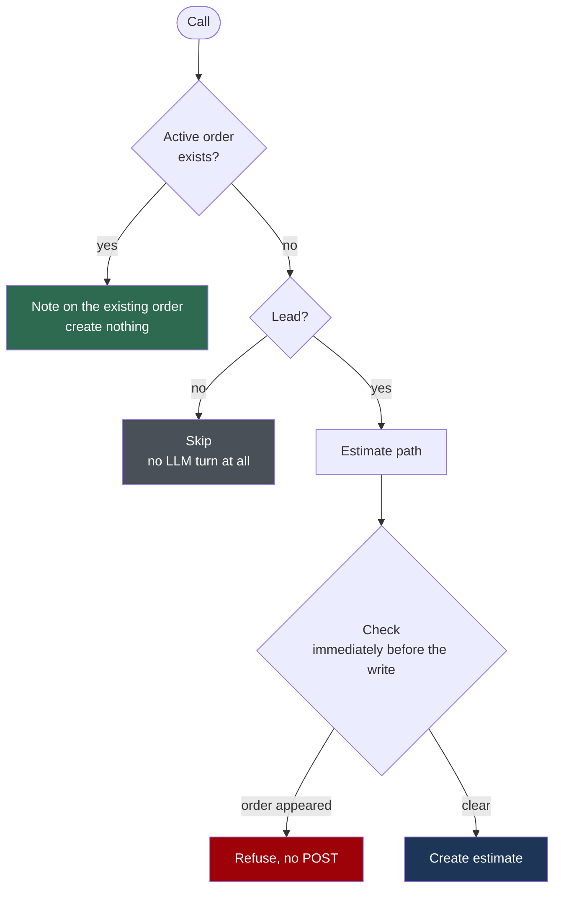
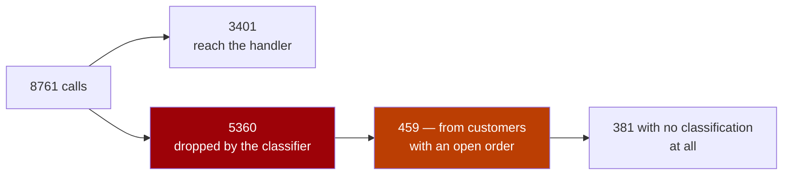

# Diagrams in a PR body

GitHub renders ```mermaid``` fences in PR descriptions, issues and comments. A diagram earns
its place when the reviewer would otherwise have to rebuild a picture in their head — an order
of events across parties, a decision with branches, a population splitting. It does not earn
its place by illustrating a sentence that was already clear.

**Rule of thumb:** two to four in a substantial PR, zero in a small one, and every one of them
answers a question the prose does not.

## Pick the form from what you are showing

| You are showing | Form | Why this one |
|---|---|---|
| Something went wrong *between parties, over time* | `sequenceDiagram` | Only a sequence shows who acted while who was blind — the cause of most agent/API/human bugs |
| A decision that used to live in a prompt or in prose | `flowchart TD` | Boxes expose the branch nobody thought about; a paragraph hides it |
| Where a population goes | `flowchart LR` with counts in the labels | Turns "unreliable" into a number the reviewer can argue with |
| Before vs after, two states, a few fields | **a table** | Do not draw what a table says better |
| The file layout of your diff | **nothing** | The diff already renders it |

## sequenceDiagram — the mechanism of a failure



- Participants are the real actors, named as the reader knows them.
- `-->>` for a response, `->>` for a call: the asymmetry is what makes the blind spot visible.
- Put the surprise in a `Note over` — that is the line the reviewer will quote back to you.
- `<br/>` breaks a long note; keep each line short enough for a narrow column.

## flowchart TD — the decision, drawn



- `{}` is a question, `[]` an action, `([])` an entry point. Keep to those three.
- One edge per answer, labelled with the answer — not with a sentence.
- Colour **outcomes only**: red for the refused path, green for the safe one, grey for a skip.
  A diagram where every node is coloured says nothing.

## flowchart LR — the funnel, with real counts



- The numbers go **inside** the labels; a funnel without counts is a shrug.
- Every count comes from a query you ran. If you cannot count a branch, do not draw the branch.
- Two or three levels. A deeper tree stops being readable in the PR column.

## Quote any label that carries punctuation

A label is parsed with mermaid's own grammar, so a bracket or a separator inside it ends the
statement early and the whole diagram is replaced by a parse error in the PR. Observed: a note
reading ``` не в [;&|(] ``` failed with `Expecting 'NEWLINE', … got 'INVALID'` — and the PR
showed no diagram at all until it was fixed.

**Wrap the label in `"…"` the moment it contains anything but words, digits and spaces.** That
turns the punctuation into data:

```
D["deny — цель невозможно проверить"]          %% not D[deny: …]
O{"это /dev или каталог задания?"}             %% not O{/dev …?}
V -->|"осталось нераскрытым"| D                %% edge labels too
```

Safe unquoted (these render as-is): plain prose, `#4231`, `create_estimate (…)` in a
`sequenceDiagram` message, and `<br/>`, which is mermaid's own line break.

Better still: **don't put code in a diagram.** A regex, a flag list or a shell fragment as a
node label is both the thing most likely to break the parser and the thing a reader cannot
follow at diagram size. Name the mechanism in words in the box; put the literal in the prose
underneath, where a backtick span renders it correctly.

## Before you paste it in

- Every label with punctuation is quoted (above). This is the failure that produces a PR with
  a grey error box where the diagram should be.
- Would a table say it better? Then use the table.
- Does any label contain a number you did not measure? Remove the number, or go measure it.
