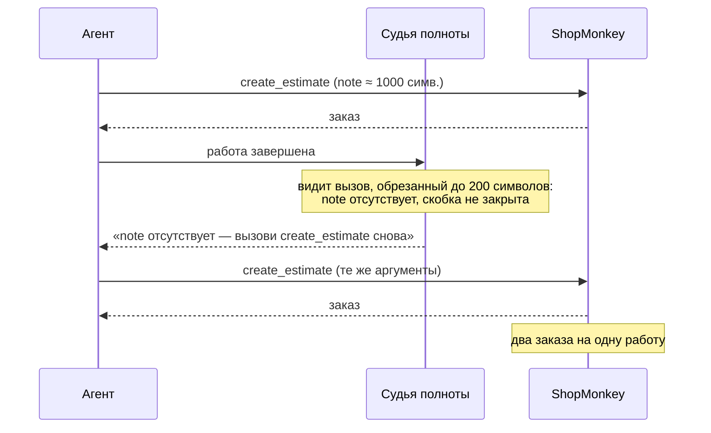
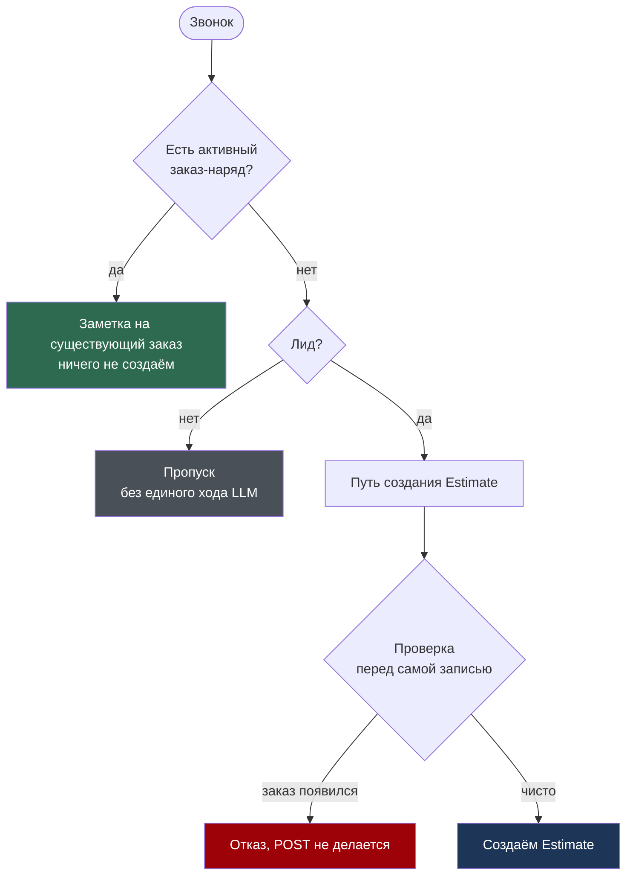
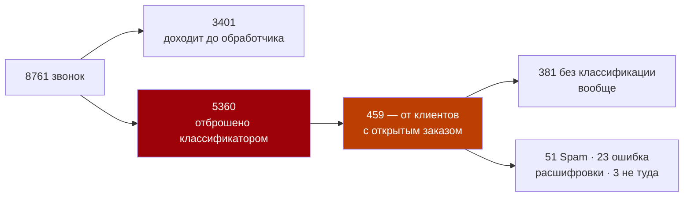

# Worked example — a PR body that changed a decision

Abridged from `galilei2050/backend#297` ("Остановить создание дубликатов заказ-нарядов ИИ-агентом",
1924 additions across 23 files). The annotations in **[brackets]** are not part of the body — they
say why each part earns its place.

---

## Что было не так

ИИ-агент создавал второй заказ-наряд рядом с тем, который сервис-адвайзер только что завёл
руками. За 24 июля — 14 августа агент создал **62 заказа**, из них персонал **23 заархивировал
и 5 удалил**.

Причин оказалось две, независимые друг от друга.

**[Opens with the damage, counted from production — not with "fixes a bug in order creation".
The two-independent-causes sentence tells the reviewer to expect two mechanisms, so neither
looks like a repetition of the other.]**

### 1. Судья сам требовал создать заказ повторно

Аргументы каждого вызова инструмента обрезаются до 200 символов перед показом судье
завершённости. Реальный `create_estimate` весит ~1000 символов, поэтому судья видел обрубок
без поля `note` — и делал единственный доступный ему вывод.

Из мыслей агента в трейсе `c3f029d7`: *«вызвать create_estimate снова — значит создать
дубликат, но проверка полноты меня к этому толкает»*. Так произошло в 3 прогонах из 53:
пары **#4231+#4232**, **#4249+#4250**, **#4266+#4267**.

**[The `sequenceDiagram` carries what prose is bad at: one party acting on a truncated view of
what another party did. The `Note over` is where the surprise lives. Then a quote from a real
trace and the actual order-number pairs — a reviewer can go look them up.]**

### 2. Проверка на дубликат жила текстом в промпте и проигрывала

Три способа сломаться, все подтверждены трейсами:

- **порядок шагов не обязателен** — в прогоне для #4248 проверка выполнилась через три хода
  **после** создания заказа;
- **окно между проверкой и записью — весь прогон** (1–3 минуты), а адвайзер печатает как раз
  в это время;
- **фильтр только по `status="Estimate"`** — work order (#4327) или сразу выставленный инвойс
  (#4362) для проверки невидимы.

---

## Что сделано

Выбор задачи переехал из промпта в код. Матрица решается на данных **до** запуска модели:

| уровень | когда | что спрашивает |
|---|---|---|
| маршрутизация | до запуска модели | есть ли что обновлять — открытый Estimate или RepairOrder |
| страж записи | за мгновение до POST | будет ли дубликат — то же плюс любой заказ за 24 часа |

**[The `flowchart TD` is the decision that used to be a paragraph of prompt text. Drawn as
boxes, the reviewer can see every branch at once and check that none is missing. Colour marks
outcomes only. The table beside it says *when* each layer runs — a thing the diagram cannot.]**

---

## Протокол решения: обрабатывать все звонки

Отдельным документом (`docs/design/service-order-call-handling.md`) записано согласованное
решение — **не полагаться на надёжность классификации**. Измерено на проде за 90 дней:

**Решение принято, но не реализовано** — код в этом PR по-прежнему работает по старому правилу.

**[This is the section that changed the decision. The funnel with real counts turns "the
classifier is unreliable" into 459 calls that should have been handled and were not. And the
bold line keeps the reviewer from believing the PR does something it does not.]**

---

## Проверки

- [x] 396 тестов бэкенда зелёные (партиями — общий прогон валит контейнер Mongo, известный сбой окружения)
- [x] Линт: ruff, anon_lint, mypy — 207 файлов
- [x] Мутационная проверка: обе исходные поломки доказаны красными без фикса
- [ ] Живые CLI-проверки — заблокированы плановыми работами ShopMonkey (503)

## Риск

- **Низкий** — `SERVICE_ORDER_CREATION_ENABLED` по-прежнему `False`, создание заказов выключено.
- **Откат** — revert ветки; ни миграций, ни инфраструктуры.

## Хвосты

- Поднять обрезку в 200 символов у судьи в baski (заблокировано границей проектов).
- Перезапустить живые CLI-проверки после окончания работ ShopMonkey.

**[Checks name the command and the real outcome, including the unchecked box with its reason.
Risk names the flag that makes the blast radius small. Хвосты is what the next person picks up.]**
